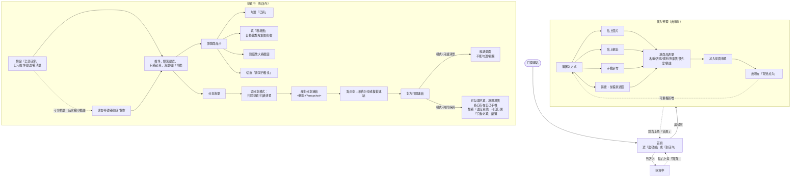

# 採買口袋清單 — 使用流程

依目前 `index.html` / `script.js` 實際行為整理，共兩大模式，從首頁分流。

## 整體流程圖

## 1. 首頁

- 兩張卡片：**出發前｜匯入整理**、**到店內｜採買中**
- 右上角「首頁」按鈕可從任何畫面回到這裡

## 2. 匯入整理（出發前）

**四種加商品的方式**（都會導到同一張表單）：
| 方式 | 說明 |
|---|---|
| 貼上圖片 | 在相簿/網頁先複製截圖，回來按「讀取剪貼簿圖片」；iPhone 上按鈕可能失效，改成點貼上區長按貼上 |
| 貼上網址 | 直接聚焦「來源」欄位，貼 IG/Threads/文章連結 |
| 手動新增 | 直接聚焦「商品名稱」欄位輸入 |
| 備援：從檔案選圖 | 當瀏覽器內建視窗（如 ChatGPT App）不給貼上時，改用檔案選取 |

**表單欄位**：來源/備註、商品名稱（必填）、店家（唐吉軻德/藥妝店/超市）、類別（保健藥妝/美妝保養/食品伴手禮/育兒日用品）、蒐集價、優先度（必買/看價格）、找貨備註、（可選）商品截圖

送出後：加進清單、清空表單、顯示在下方「最近加入」（最多顯示 4 筆，新的在前）。

「重置範例」按鈕會清空 localStorage，換回內建的 7 筆範例商品。

## 3. 採買中（到店內）

**第一步：店家範圍** — 預設是「全部店家」，一進畫面就能搜尋、篩選、看清單，不用先選店家。
唐吉軻德／藥妝店／超市每個按鈕會顯示「已買/總數」，點下去是**縮小範圍**（只看這家店），不是必要的前置步驟。

**可以做的事**：
- 搜尋商品名/備註/來源
- 依類別篩選（含「只看必買」開關）
- 切換「清單／圖卡」兩種排版
- 商品卡上：勾「已買」、填「現場價」（自動算出比蒐集價省或貴多少）、點截圖放大看、切換「請同行者找」

**分享清單**：
1. 選分享模式：
   - **共同採買**：同行者可看進度、也能各自勾選已買。想只看「還沒買的」，對方自己在清單上開「只看必買」篩選即可，不用另外開分享模式
   - **只讀清單**：對方只能看，不能改
2. 系統會即時把目前清單（不含圖片）打包進網址的 `?snapshot=` 參數，產生分享連結
3. 按「分享」→ 手機支援的話跳出系統分享選單，不支援就複製連結/文字到剪貼簿

對方打開分享連結後，是「各自獨立的一份」：彼此的勾選、填價不會互相同步（沒有即時連線），只讀模式則完全鎖住不能動。

## 資料存放小提醒

- 一般編輯都存在**自己手機的瀏覽器**（localStorage），換手機、清瀏覽器資料就會不見
- 分享連結**不含圖片**（截圖只留在原手機上，避免連結太長）
- 若截圖太多把手機儲存塞滿，系統會自動先丟掉圖片、只留文字清單，並跳提示
